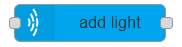

# add light

## Usage

Adds a light source to the Where.

## Configuration

- `Create on` Sets whether the light is created on `initialization` or `input`
  - `Initialization` The light is added to the Where when the flow is started/deployed
  - `Input`: A light is added when the node gets an input. The input `msg.payload` content can overwrite properties of the light to create. [`Here`](https://github.com/MaxWhere/mxw-devguide/blob/master/docs/api/light.md#new-lightoptions) you can see the options.
- `NodeID` ID of MaxWhere node to be set.
- `position`The Node's position in 3d scene. Default is {x: 0.0, y: 0.0, z: 0.0}.
- `orientation` {x, y, z, w} - Node's orientation in 3d scene. Default is {w: 1.0, x: 0.0, y: 0.0, z: 0.0}
- `scale` {x, y, z} | Number - The Node's scale along axes. Default is {x: 1.0, y: 1.0, z: 1.0}.
- `lighttype` The light's type. Possible values are: spot, directional, point (default).
- `diffuse` The diffuse color of the light {r, g, b, a}. Default is {r: 1.0, g: 1.0, b: 1.0, a: 1.0}.
- `specular` The specular color of the light {r, g, b, a}. Default is {r: 1.0, g: 1.0, b: 1.0, a: 1.0}.
- `range` The range parameters of the light source {inner_angle: (Degree), outer_angle: (Degree), falloff: Number}. Default is {inner_angle: 35, outer_angle: 70, falloff: 1}.
- `attenuation` The attenuation coefficients of the light source {range, constant, linear, quadratic}, where properties are positive Numbers (constant is in range [0, 1]). Default is {range: 5000, constant: 1, linear: 0.0009, quadratic: 0.000003}, .
- `direction` The 3D vector towards the light will point {x, y, z}. Default is {x: 0, y: -1, z: 0}.

- `Display name` Name of the node in the editor.

## Input

If `Create on` is set to `input` it adds a light and `msg.payload` overwrites provided `options`.

## Output

After light is created a message is added to `msg.payload`.
