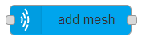

# add mesh

## Usage

Adds a mesh to the Where.

## Configuration

- `Create on` Sets whether the mesh is created on `initialization` or `input`
  - `Initialization` The mesh is added to the Where when the flow is started/deployed
  - `Input`: A mesh is added when the node gets an input. The input `msg.payload` content can overwrite properties of the mesh to create. [`Here`](https://github.com/MaxWhere/mxw-devguide/blob/master/docs/api/mesh.md#new-meshoptions) you can see the `options`.
- `Node id` ID of MaxWhere node to be set.
- `Mesh file` Name of the mesh file to use
- `Position` The Node's position in 3d scene. Default is {x: 0.0, y: 0.0, z: 0.0}.
- `Orientation` {x, y, z, w} - Node's orientation in 3d scene. Default is {w: 1.0, x: 0.0, y: 0.0, z: 0.0}
- `Scale` {x, y, z} | Number - The Node's scale along axes. Default is {x: 1.0, y: 1.0, z: 1.0}.
- `Physical`
  - `autophysical` Whether to generate a simple physical shape for the Node.
  - `raycast` Whether the physical is pointable by mouse.
- `Save` If turned on the runtime changes made to the `position`, `orientation` and `scale` are saved when the `Ctrl + S` key combination is used. Currently only supported if `Create on` is set to `Initialization`.
- `Display name` Name of the node in the editor.

## Input

If `Create on` is set to `input` it adds a mesh and `msg.payload` overwrites provided `options`.

## Output

After mesh is created a message is added to `msg.payload`.
