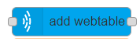

# add webtable

## Usage

Adds a webtable to the Where.

## Configuration

- `Create on` Sets whether the webtable is created on `initialization` or `input`
  - `Initialization` The webtable is added to the Where when the flow is started/deployed
  - `Input`: A webtable is added when the node gets an input. The input `msg.payload` content can overwrite properties of the webtable to create. [`Here`](https://github.com/MaxWhere/mxw-devguide/blob/master/docs/api/webtable.md#new-webtableoptions) you can see the options.
- `Node id` ID of MaxWhere node to be set.
- `url` Current URL to load after webtable is successfully initialized.
- `Behvaior`
  - `Always on` overlay is always visible
  - `3D only` overlay is only visible on 3D mode
  - `Menu only` overlay is only visible on 2D menu
- `position` The Node's position in 3d scene. Default is {x: 0.0, y: 0.0, z: 0.0}.
- `orientation` {x, y, z, w} - Node's orientation in 3d scene. Default is {w: 1.0, x: 0.0, y: 0.0, z: 0.0}
- `scale` {x, y, z} | Number - The Node's scale along axes. Default is {x: 1.0, y: 1.0, z: 1.0}.
- `Physical`
  - `autophysical` Whether to generate a simple physical shape for the Node.
  - `raycast` Whether the physical is pointable by mouse.
- `Canvas`
  - `location` The location of Canvas. Can be rendered into the 3d scene (in-game) or on the overlay of native window (overlay) in front of every scene object. Possible values are: in-game (default), overlay.
  - `width` The width of Canvas in Ogre units (in-game) or pixels (overlay). Default is 1280.
  - `height` - The height of Canvas in Ogre units (in-game) or pixels (overlay). Default is 720.
  - `resolution-width` The resolution width of the Canvas's texture in pixels (Integer). Default is 1280.
  - `resolution-height` The resolution height of the Canvas's texture in pixels (Integer). Default is 720.
  - `transparent` Whether the Canvas is transparent. Alpha channel of texture's pixel color is used for transparency values. Default is true.
  - `zOrder` Z order of overlay type Canvas (Integer). Overlay with greater Z order covers overlays with less Z order. Default is 1.
  - `metrics` Determines the metrics used for left and top for overlay type Canvas. Possible values are pixels (default), relative
  - `left` For overlay type, the offset from the left of the window. Default is 0.
  - `top` For overlay type, the offset from the top of the window. Default is 0.
  - `horizontal-align` - Determines how to align the overlay type Canvas horizontally. left's 0 point depends on this alignment. Possible values are left (default), center, right.
  - `vertical-align` Determines how to align the overlay type Canvas vertically. top's 0 point depends on this alignment. Possible values are top (default), center, bottom
  - `disableIngamePhysical` Determines whether Canvas registers canvas type physical shape matching Canvas's dimensions when created. If true physical shape is not registered (always true for overlay). Default is false.
- `Webview`
  - `inputDisabled` Boolean (optional) - Disable mouse and key inputs for `BrowserWindow` of this `Webview`. Default is `true`.
  - `directKeyEvent` Boolean (optional) - Determines whether the `BrowserWindow` of `Webview` is listening for any key event (`false`) or only for those emitted while the mouse hovers the `Webview` (`true`). Hover is detected either by physical shape (`in-game`) or mouse position intersection (`overlay`) Default is `true`.
  - `nodeIntegration` Boolean (optional) - Enable node integration in [`BrowserWindow`](https://electronjs.org/docs/api/browser-window#new-browserwindowoptions) of `Webview`. Default is `false`.
  - `webSecurity` Boolean (optional) - Enable web security in [`BrowserWindow`](https://electronjs.org/docs/api/browser-window#new-browserwindowoptions) of `Webview`. Default is `true`.
  - `scaleFactor` Number (optional, positive) - Pixel scale factor of [`BrowserWindow`](https://electronjs.org/docs/api/browser-window#new-browserwindowoptions). Default is the scale factor of native window (or `1` if that's not available).
- `Webtable`
  - `index` Index number of webtable, which is used as a reference to this webtable instance (and displayed on default maxwhere page).
  - `private` Whether this webtable should be excluded from bundle export.
  - `auto-resolution` Whether the resolution of the webview should be automatically calculated from the resolution and pixel scale factor of the containing display. If defined, 'resolution-width' and resolution-height` options will not be applied. The auto-generated resolution will precisely match the covered screen resolution in zoomed-in state
  - `urlControls` Whether to create URL control UI overlay bar to this webtable. Without URL control bar the content of the webview cannot be changed. Default is true
  - `savedURL` - Pinned URL, which can be loaded with 'Return to Pin' and overwritten with 'Pin'. Considered as the user's personal saved URL
  - `factoryURL` Factory default URL, which can be loaded with 'Return to default'. Considered as the Home URL defined by the designer of the Where
- `Save` If turned on the runtime changes made to the `position`, `orientation` and `scale` are saved when the `Ctrl + S` key combination is used. Currently only supported if `Create on` is set to `Initialization`.
- `Display name` Name of the node in the editor.

## Input

If `Create on` is set to `input` it adds a webtable and `msg.payload` overwrites provided `options`.

## Output

After webtable is created a message is added to `msg.payload`.
