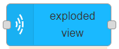

# exploded view

## Usage

Toggles exploded view on a node which has children nodes (mesh hierarchy).

## Configuration

- `NodeID` ID of MaxWhere node
- `displacementFactor` extent of displacement of the children nodes from the parent node
- `Name` Name of the node in the editor.

## Input

Input triggers the node but `msg` content is not used, so it has not affect.

## Output

Chosen MaxWhere node is added to `msg.payload`.
