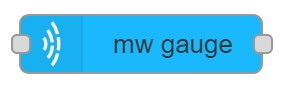
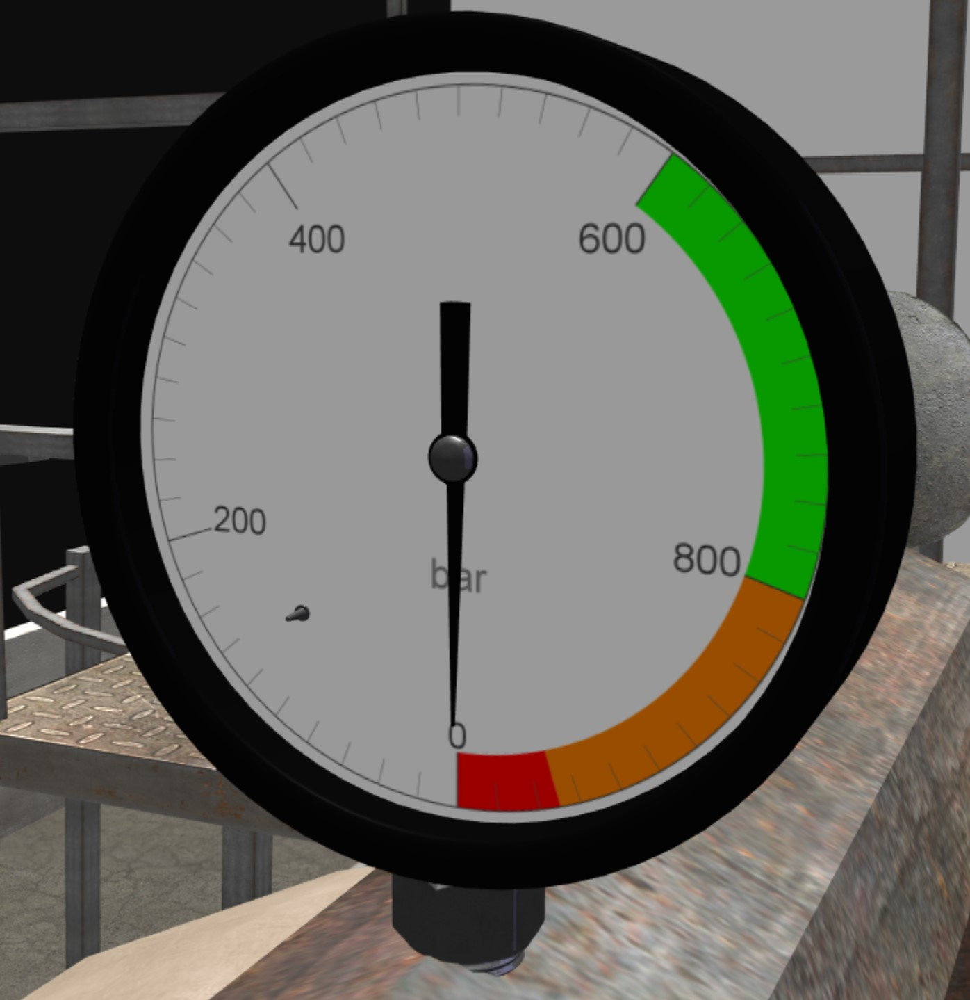

# mw gauge

## Usage
Creates a gauge which can be used to display numeric values.
Gauge contains three meshes
- **Body** Body of the gauge.
- **Dial** Children of the body. Dial texture is generated on it.
- **Needle** Chldren of the dial. Rotation of needle indicates the value.

- `Minimum angle` Minimum angle of needle that can be set.
- `Maximum angle`  Maxiumum angle of needle that can be set.
{: style="width:70%"}
## Configuration
Configuration can be set in two different ways, depending of the `Configuration method` value.
### Configuration from file

- `File Name` Name of the configuration file.
- `Name` Name of the node in the editor.

### Local configuration

- `NodeID` ID of MaxWhere node to be set.
- Mapping
    * `Minimum angle` Minimum angle of needle that can be set.
    * `Maximum angle`  Maximum angle of needle that can be set.
    * `Minimum value` Minimum value that can be displayed on gauge.
    * `Maximum value`  Maximum value that can be displayed on gauge.
- Body
    * `mesh url` Name of Ogre mesh file.
    * `physical mesh url` Name of .obj file that contains the physical shape of the object.
    * `shape` Name of shape type.
    * Position
        + `x` x coordinate of position to set
        + `y` y coordinate of position to set
        + `z` z coordinate of position to set
    * Orientation
        + `w` w member of orientation quaternion to set
        + `x` x member of orientation quaternion to set
        + `y` y member of orientation quaternion to set
        + `z` z member of orientation quaternion to set
    * `Scale` Scale to set.
- Dial
    * `mesh url` Name of Ogre mesh file.
    * `physical mesh url` Name of .obj file that contains the physical shape of the object.
    * `shape` Name of shape type.
    * Position
        + `x` x coordinate of position to set
        + `y` y coordinate of position to set
        + `z` z coordinate of position to set
    * Orientation
        + `w` w member of orientation quaternion to set
        + `x` x member of orientation quaternion to set
        + `y` y member of orientation quaternion to set
        + `z` z member of orientation quaternion to set
    * `Scale` Scale to set.
- Needle
    * `mesh url` Name of Ogre mesh file.
    * `physical mesh url` Name of .obj file that contains the physical shape of the object.
    * `shape` Name of shape type.
    * Position
        + `x` x coordinate of position to set
        + `y` y coordinate of position to set
        + `z` z coordinate of position to set
    * Orientation
        + `w` w member of orientation quaternion to set
        + `x` x member of orientation quaternion to set
        + `y` y member of orientation quaternion to set
        + `z` z member of orientation quaternion to set
    * `Scale` Scale to set.
    * Rotation axis
        + `x` x member of rotation axis
        + `y` y member of rotation axis
        + `z` z member of rotation axis
- Texture
    * `Width(pixel)` Width of the dial texture.
    * `Height(pixel)` Height of the dial texture.
    * `Units` Units to be displayed on dial texture.
    * `Major ticks` Value where major tick should be displayed. Multiple can be set with **,** separator.
    * `Plate color` Color of plate that can be set with hexcolor code.
    * `Highlights(from, to,color)` Highlights to be displayed.
- `Name` Name of the node in the editor.

        

        
## Input
Input value is dispayed by needle.

## Output
No output.
