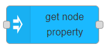

# get node property

## Usage

Gets the specified node's position, orientation or scale.

## Configuration

- `NodeID` ID of MaxWhere node where orientation should be set.
- `Property` Specifies the propert type to get. Possible values are `position`, `orientation` and `scale`.
- `Display name` Name of the node in the editor.

## Input

Input triggers the node.

## Output

Specified property is added to `msg.payload`.
