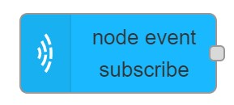

# node event subscribe

## Usage

Registers an event listener. Handler function will be called every time when the specified event is fired on the maxwhere node.

## Configuration

- `NodeID` ID of MaxWhere node where event handler should be set.
- `Event Name` Event name to handle.
- `Name` Name of the node in the editor.

## Input

No input.

## Output

Event Object added to `msg.payload` containing different properties according to the event type.
