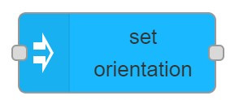

# set orientation

## Usage

Sets the orientation of the Node, where orientation in defined in the given space and applied in the given reference.

## Configuration

- `NodeID` ID of MaxWhere node where orientation should be set.
- `Data source` Whether `Orientation` is `Set here` or coming from `Input`
    - If set to `Set here` orientation can be set on the editor
        - `Orientation type` can be either `quaternion` or `angle-axis`
            - `quaternion` {x, y, z, w} orienation to set as `quaternion`
            - `angle-axis` {angle, axis}, where angle is Number and axis is {x, y, z}
- `Refernece` Reference of the adjustment.
- `Space` Space the adjustment is applied in.

- `Display name` Name of the node in the editor.

## Input

- if `Data source` is set to `Set here` then input triggers the node, but `msg` content is not used.
- If `Data source` is set to `input` then `msg.payload` is used as `Orientation`
  Orientation to set as {w, x, y, z} or {angle, axis}, where angle is Number and axis can be either {x, y, z}
    - Example for valid input: `{"x":1,"y":0,"z":0,"w":1}` or `{"axis":{"x":1,"y":0,"z":0},"angle":10}`

## Output

After orientation is set a message is added to `msg.payload`.
