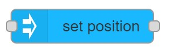

# set position

## Usage

Sets the position of the Node, where position in defined in the given space and applied in the given reference.

## Configuration

- `NodeID` ID of MaxWhere node where position should be set.
- `Data source` Whether `Position` is `Set here` or coming from `Input`
    - If set to `Set here` position can be set on the editor
        - `position` The Node's position to set in the 3d scene.
- `Reference` Reference of the adjustment.
- `Space` Space the adjustment is applied in.

- `Display name` Name of the node in the editor.

## Input

- if `Data source` is set to `Set here` then input triggers the node, but `msg` content is not used.
- If `Data source` is set to `input` then `msg.payload` is used as `Position`
    - Example for valid input: `{"x":10, y:"20" z:"20"}`

## Output

After position is set a message is sent on the output.
