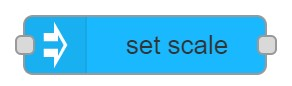

# set scale

## Usage

Sets the scale of Node along every dimension. Scale values are defined in the given space in the given reference.

## Configuration

- `NodeID` ID of MaxWhere node where scale should be set.
- `Data source` Whether `scale` is `Set here` or coming from `Input`
    - If set to `Set here` scale can be set on the editor
        - `scale`The Node's scale to set in the 3d scene.
- `Reference` Reference of the adjustment.
- `Space` Space the adjustment is applied in.
- `Display name` Name of the node in the editor.

## Input

- if `Data source` is set in the node form than input triggers the node, but `msg` content is not used.
- If `Data source` is coming from an input than `msg.payload` is used as `Scale`
    - Example for valid input: `{"x":1.1, y:"1.1" z:"1.1"}`

## Output

After scale is set a message is added to `msg.payload`
