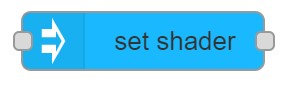

# set shader

## Usage

Sets the value of the specified PBS shader parameter.

## Configuration

- `NodeID` ID of MaxWhere node where shader should be set.

- `Shader` Name of the shader.
- `Data source` Whether `shader` value is `Set here` or coming from `Input`
    - If set to `Set here` shader value can be set on the editor
        - `value` Shader parameter value to set.
- `Refernece` Reference of the adjustment.
- `Display name` Name of the node in the editor.

## Input

- if `Data source` is set to `Set here` then input triggers the node, but `msg` content is not used.
- If `Data source` is set to `input` then `msg.payload` is used as `Value`
    - Example for valid input: `0.5`

## Output

After shader is set a message is added to `msg.payload`
