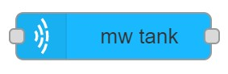
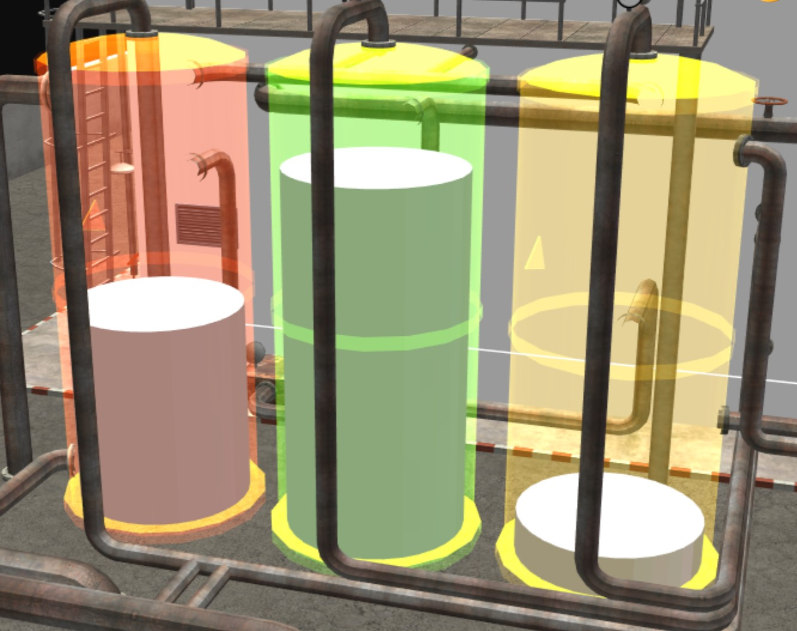
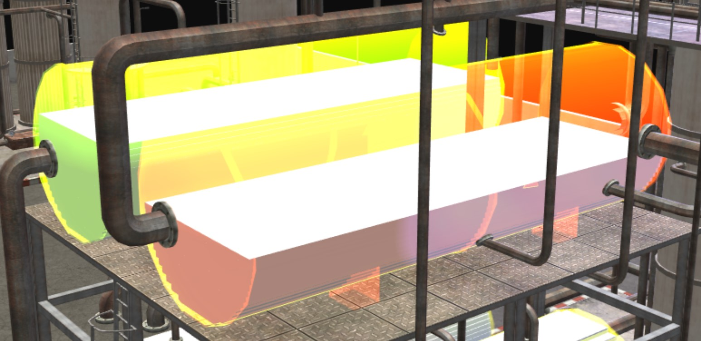

# mw tank

## Usage
Creates a tank which can be used to display values by changing surface color.
The tank contains liquid which can be used to display the fullness of the tank by setting the level.

## Types of tanks
### Vertical tank
The vertical tank is built from two elements. The tank itself and it contains a cylinder which represents the liquid.
{: style="width:70%"}
#### Configuration
##### Configuration from file
- `File Name` Name of the configuration file.
- `Name` Name of the node in the editor.

##### Local configuration
- `NodeID` ID of MaxWhere node to be set.
- Mapping
    * `Minimum liquid value` Minimum value which can by displayed by the liquid.
    * `Maximum liquid value`  Maximum value which can by displayed by the liquid.
    * `Minimum value for color indicator` Minimum value which can by displayed by the surface color.
    * `Maximum value for color indicator`  Maximum value which can by displayed by the surface color.
    * `Transparent material`  Transparent material for the tank to make liquid visible.
- Tank
    * `mesh url` Name of Ogre mesh file.
    * `physical mesh url` Name of .obj file that contains the physical shape of the object.
    * `shape` Name of shape type.
    * Position
        + `x` x coordinate of position to set
        + `y` y coordinate of position to set
        + `z` z coordinate of position to set
    * Orientation
        + `w` w member of orientation quaternion to set
        + `x` x member of orientation quaternion to set
        + `y` y member of orientation quaternion to set
        + `z` z member of orientation quaternion to set
    * `Scale` Scale to set.
- Liquid
    * `mesh url` Name of Ogre mesh file.
    * `physical mesh url` Name of .obj file that contains the physical shape of the object.
    * `shape` Name of shape type.
    * Position
        + `x` x coordinate of position to set
        + `y` y coordinate of position to set
        + `z` z coordinate of position to set
    * Orientation
        + `w` w member of orientation quaternion to set
        + `x` x member of orientation quaternion to set
        + `y` y member of orientation quaternion to set
        + `z` z member of orientation quaternion to set
    * Scale
        + `x` scale along x coordinate to set
        + `y` scale along y coordinate to set
        + `z` scale along z coordinate to set
    * Max Scale
        + `x` maximum scale along x coordinate which fits inside tank
        + `y` maximum scale along y coordinate which fits inside tank
        + `z` maximum scale along z coordinate which fits inside tank

- `Name` Name of the node in the editor.
### Horizontal tank
The horizontal tank is built from two elements. The tank itself and it contains `resolution` number of building blocks which are representing the liquid.
{: style="width:70%"}
#### Configuration
##### Configuration from file
- `File Name` Name of the configuration file.
- `Name` Name of the node in the editor.

##### Local configuration
- `NodeID` ID of MaxWhere node to be set.
- Mapping
    * `Minimum liquid value` Minimum value which can by displayed by the liquid.
    * `Maximum liquid value`  Maximum value which can by displayed by the liquid.
    * `Minimum value for color indicator` Minimum value which can by displayed by the surface color.
    * `Maximum value for color indicator`  Maximum value which can by displayed by the surface color.
    * `Transparent material`  Transparent material for the tank to make liquid visible.
- Tank
    * `mesh url` Name of Ogre mesh file.
    * `physical mesh url` Name of .obj file that contains the physical shape of the object.
    * `shape` Name of shape type.
    * Position
        + `x` x coordinate of position to set
        + `y` y coordinate of position to set
        + `z` z coordinate of position to set
    * Orientation
        + `w` w member of orientation quaternion to set
        + `x` x member of orientation quaternion to set
        + `y` y member of orientation quaternion to set
        + `z` z member of orientation quaternion to set
    * `Scale` Scale to set.
    * `Length` Length of tank.
    * `Radius` Radius of tank.
- Liquid
    * `mesh url` Name of Ogre mesh file.
    * `resolution` Number of liquid building blocks 
    * `edge length` Edge lenfth of building block.
    

- `Name` Name of the node in the editor.

        
## Input
The input value can set the following features.
- If `msg.topic` is `setColor` than the value is setting the surface color of the tank.
- If `msg.topic` is `setLevel` than the value is setting the level of the liquid.
- If `msg.topic` is `toggleTransparency` than the material is toggling between the trasparent material and the original.

## Output
No output.