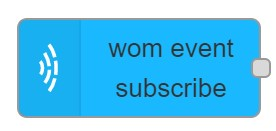

# wom event subscribe

## Usage

Registers an event listener. Handler function will be called every time when the specified event is fired in maxwhere engine or wom.

## Configuration

- `Event Name` Event name to handle.
- `subject` ID of event's subject to register. Listener will be called only if event's subject matches this id.
- `Name` Name of the node in the editor.

## Input

No input allowed.

## Output

Event Object added to `msg.payload` containing different properties according to the event type.
