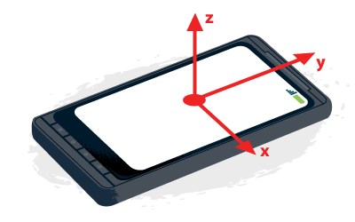

# **Platypous-Web-Based-Controller(WIP)**
Simple website based controller for Platyous robot, built using HTML, CSS and Javascript. The project requires an external MQTT broker to work correctly. The Platypous robot needs to be connected to the same MQTT broker!
**The website only works for devices with a built in orientation sensor!!!**

Images from the website:
- [Default state, user can take control of the robot](../images/webpage/web0.jpg)
- [User is controlling the robot, the dot moves as the device orientation is changed. This helps the user keep track of the controls.](../images/webpage/web1.jpg)
- [Other user is controlling the robot. While this is the case the user cannot interact with the webpage, and the dot is greyed out.](../images/webpage/web2.jpg)

## **Functionalities**
The website uses the user device's built in orientation sensor to control the robot. The interface also prevents multiple users from controlling the device at the same time to prevent unintended behaviors.

 
<i>Coordinate system of the phone</i>

Depending on the user device's orientation the robot starts to move. The corresponding movements are the following:
|                                     | **X-wise rotation**   | **Y-wise rotation**       |
|-------------------------------------|-----------------------|---------------------------|
| **Away from self/Clockwise rotation**   | Robot moves forwards | Robot turns clockwise     |
| **Towards self/Anticlockwise rotation** | Robot moves backwards | Robot turns anticlockwise |

The controller surface contains a "Dead zone" on which the robot doesn't move. This is implemented to avoid uncontrollable small orientation changes resulting in the movement of the robot.

### **MQTT communication**

The website uses the IBM Paho library to communicate with the MQTT broker using WebSockets. The port and hostname that is used for the connection with the MQTT broker can be configured in the [script.js](./script.js) file.

#### **Requirements for the MQTT broker to work with the website**
- The MQTT broker must be reachable using WebSockets
- The MQTT broker requires a valid certificate and implementation of HTTPS (and WSS) protocols. This can be circumnavigated by disabling certificate checking in the client browser, **however this is highly not recommended due to security reasons! Only use this internally or for testing using a separate browser!**
